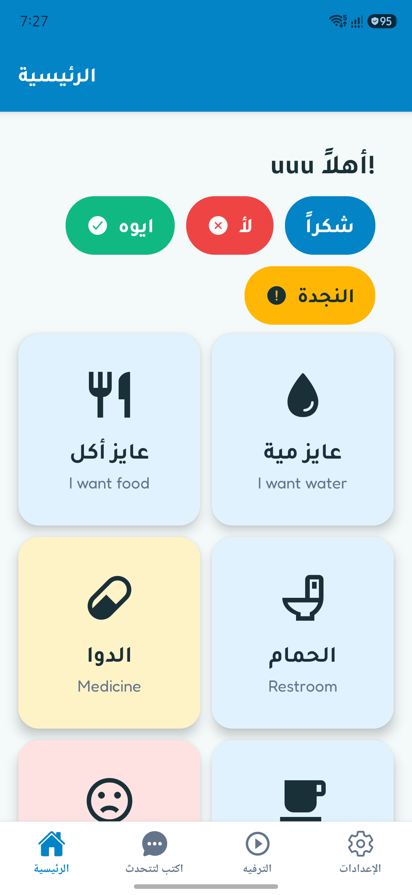
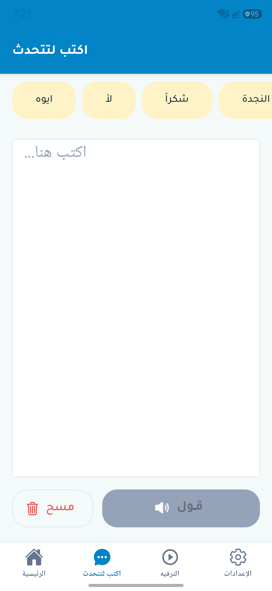
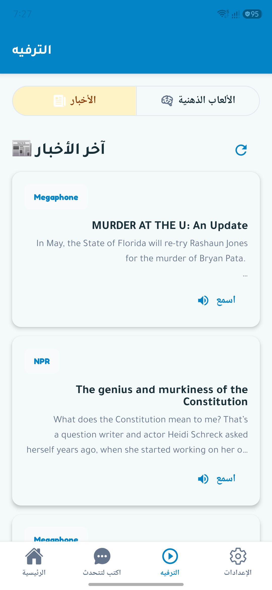
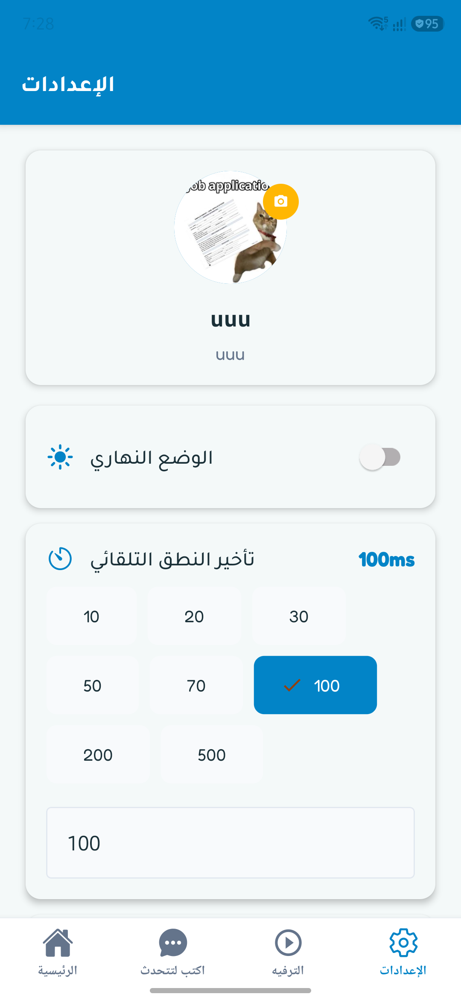
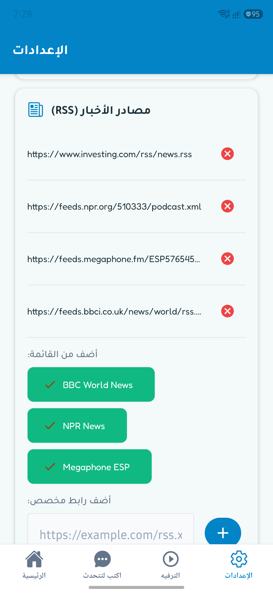
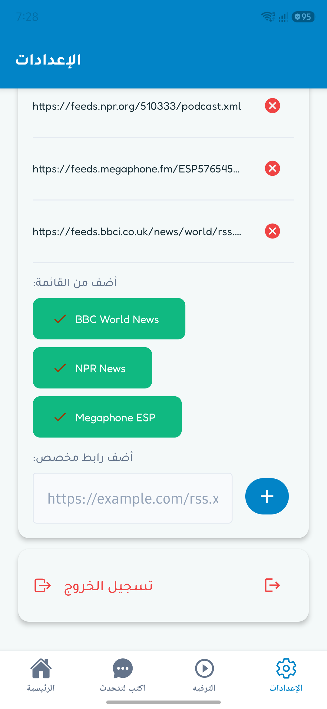

# معًا HelpPlus

An assistive communication app for stroke patients, built with Expo + React Native + React Native Paper.

---

## About

HelpPlus (معًا — "Together") is a communication aid designed for stroke patients who have difficulty speaking. Patients can communicate their needs by tapping pre-configured tiles that speak Arabic phrases aloud. The app also includes entertainment features like news reading and trivia games to keep users engaged.

---

## Screenshots

<table>
  <tr>
    <td align="center"><b>Home Dashboard</b></td>
    <td align="center"><b>Type to Talk</b></td>
    <td align="center"><b>News Reader</b></td>
  </tr>
  <tr>
    <td></td>
    <td></td>
    <td></td>
  </tr>
  <tr>
    <td align="center"><b>Trivia Game</b></td>
    <td align="center"><b>Settings</b></td>
    <td align="center"><b>Dark Mode</b></td>
  </tr>
  <tr>
    <td></td>
    <td></td>
    <td></td>
  </tr>
</table>

---

## Features

### Communication
- **Smart Dashboard** — 2-column tile grid with instant Arabic text-to-speech on tap
- **Quick Actions** — one-tap buttons for common phrases: yes, no, thanks, help
- **Type to Talk** — free typing with auto-speak on spacebar + quick phrase pills
- **Custom Tiles** — create your own cards with Arabic, English, or both — icons and colors included
- **Single-Language Cards** — add cards with text in one language only (Arabic or English)

### Entertainment
- **News Reader** — RSS feed reader with cached articles for instant display
- **Trivia Game** — Arabic trivia with 8 questions and score tracking

### Settings & Customization
- **Dark / Light Mode** — full theme toggle with accessibility-focused colors
- **Language Selector** — switch between Arabic and English, placed next to theme toggle
- **Auto-Speak Delay** — configurable 10ms–500ms delay (default 70ms)
- **RSS Feed Management** — add/remove custom RSS sources
- **Profile Image** — pick and display a profile photo
- **Tile Management** — view and delete custom tiles (defaults are locked)

### Technical
- Pull-to-refresh on all screens
- News caching for instant load
- Mock auth ready for backend integration
- AsyncStorage persistence for all settings

---

## Tech Stack

| Technology | Purpose |
|-----------|---------|
| Expo SDK 54 | Framework |
| React Native 0.81 | UI |
| React Native Paper | Material Design 3 components |
| expo-router | File-based navigation |
| expo-speech | Arabic text-to-speech |
| AsyncStorage | Local persistence |
| Tajawal + Fredoka | Arabic + English fonts |

---

## Getting Started

```bash
# Clone the repository
git clone https://github.com/asaadzx/HelpPlus-app.git
cd HelpPlus-app

# Install dependencies
npm install

# Start development server
npx expo start

# Run on Android device (USB)
adb reverse tcp:8081 tcp:8081
npx expo start --android
```

---

## Building for Production

```bash
# Install EAS CLI
npm install -g eas-cli

# Login to Expo
eas login

# Build APK (for testing)
eas build --platform android --profile preview

# Build AAB (for Play Store)
eas build --platform android --profile production
```

---

## Project Structure

```
app/
├── (tabs)/
│   ├── _layout.tsx          # Bottom tab navigator
│   ├── index.tsx            # Home — tile grid
│   ├── talk.tsx             # Type-to-Talk
│   ├── entertainment.tsx    # News + trivia
│   └── settings.tsx         # Settings + auth
├── add-tile.tsx             # Create custom tile
├── manage-tiles.tsx         # Delete custom tiles
└── _layout.tsx              # Root layout + providers
src/
├── context/
│   └── ThemeContext.tsx      # Theme + auth + autoSpeakDelay
├── i18n/
│   ├── index.tsx            # LanguageContext + t() translator
│   ├── ar.json              # Arabic translations
│   └── en.json              # English translations
├── types/
│   └── index.ts             # PhraseCard, FeedItem, TriviaQuestion, User
├── data/
│   └── defaults.ts          # DEFAULT_CARDS, TRIVIA_QUESTIONS, PRESET_FEEDS
└── utils/
    ├── icons.tsx             # renderIcon helper
    └── rss.ts                # RSS XML parser
constants/
└── theme.ts                  # Colors, fonts, Paper theme, presets
```

---

## Production Readiness

| Priority | Task | Status |
|----------|------|--------|
| HIGH | Wrap all AsyncStorage + JSON.parse in try/catch (20+ unguarded calls) | ✅ |
| HIGH | Add integration tests (card CRUD, ThemeContext, LanguageContext) | ✅ |
| MEDIUM | Delete 12 unused Expo boilerplate files (~270 dead lines) | ✅ |
| MEDIUM | Move jest/testing deps from `dependencies` → `devDependencies` | ✅ |
| MEDIUM | Enhance ESLint (`no-unused-vars`, `no-console`, expanded ignores) | ✅ |
| MEDIUM | Wrap `Speech.speak` + `ImagePicker` in try/catch (8+ calls) | ✅ |
| MEDIUM | Add ThemeContext unit tests (toggle, login, autoSpeakDelay) | ✅ |
| LOW | Add parseRSS unit tests | ✅ |

---

## Roadmap

- [ ] Smart Predictive AI Suggestion Bar (time-based + usage learning)
- [ ] Emergency SOS Trigger (shake/volume gesture detection)
- [ ] Google Play Store release
- [ ] F-Droid open-source distribution
- [ ] SQLite-backed tile storage
- [ ] Real backend auth (email/password + JWT)
- [ ] Caregiver dashboard (web) to monitor usage
- [ ] Multi-language support (English, French, Turkish)
- [ ] Voice recognition mode (speak instead of tap)

---

## License

MIT
